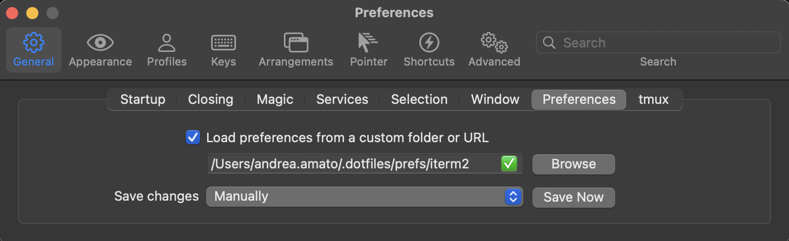

# Preferences

- [`MacOS` preferences](#macos-system-preferences)
- [`iTerm` settings](#iterm2-settings)
- [`Nuphy Air75` keyboard layout](#nuphy-air75-keyboard-layout)

## MacOS System Preferences

<!--TODO-->

_TODO: Still to integrate_

<!--TODO-->

## iTerm2 Settings

Go to `iterm2 > Settings > Preferences` and link the [app settings](/prefs/iterm2/com.googlecode.iterm2.plist), as shown below.

Alternatively, to only import the user profile but leave the locally set app preferences, go to `iterm2 > Settings > Profiles` import the [custom profile](/prefs/iterm2/profile.json), as shown below.

## Nuphy Air75 Keyboard Layout

There's no need to do anything unless further changes are desired, as the keyboard is already setup.

If further customization is needed:

1. Connect the keyboard via USB cable (keyboard should be set to wired mode)
2. Go to [usevia.app](https://usevia.app/)
3. Go to the settings tab and toggle the 'show design tab' switch on
4. Go tho the Design tab ad drag the [customized json file](/prefs/keyboard/personal-layout.json) (optionally you can start fresh with the [original json file](/prefs/keyboard/nuphy-air75-v2.json))
5. Go to the Configure tab and start messing around

> _checkout the [official guide](https://nuphy.com/pages/via-usage-guide-for-nuphy-keyboards) for more detail_
